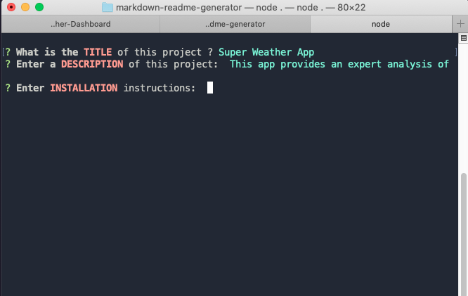
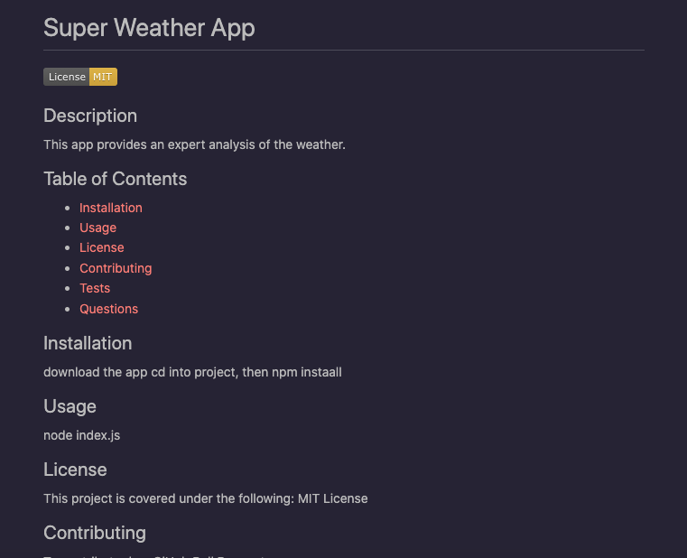

# Markdown-Readme-Generator

The Markdown Readme Generator is a Node.JS app that allows users to create GitHub Repo Readme files. This allows for the fast description of any particular repository in a standarized way. This simplifies the creation of these files, without having to know the markdown language

## Table of Contents

- [Description](#description)
- [Screen Shots](#screenshots)
- [Installation](#installation)
- [References](#references)
- [License](#license)

## Description
This repo contains a the Markdown Readme Generator Node.JS app and the corresponding code.

Github Repository: [Readme Generator](https://github.com/rbarbosa51/markdown-readme-generator)

Sample Readme File: [Sample Readme File](./dist/README.md)

Video Demo: [Video Demo](https://drive.google.com/file/d/1IFmSTOHuSitJGbRDfFFRguSIw-0QxHm-/view)

## Screenshots
MarkDown Readme Generator

Command Line

Readme Example

## Installation

Download the code (or git clone) from the repository. Once downloaded go to the corresponding folder. Then type npm install, so it can install the dependencies needed from the package.json file. This assumes that your system has Node.JS installed

## References

NPM ANSI Escape Sequences: [ANSISequences](https://www.npmjs.com/package/ansi-escape-sequences)

GitHub Badges: [Badges](https://gist.github.com/lukas-h/2a5d00690736b4c3a7ba)

## License

MIT License

---- 

